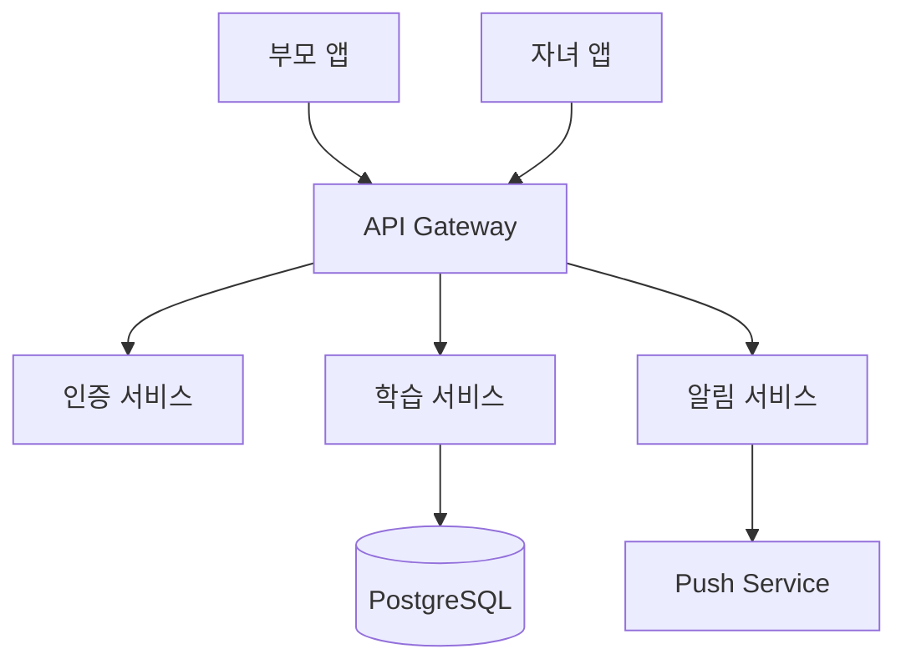

# 챕터 1: ABADA SaaS 플랫폼

ABADA는 다양한 도메인에 걸쳐 구축한 SaaS 플랫폼들의 집합입니다. 스마트공장 AI 코칭 시스템부터 자녀 학습 관리, 게임, 워크스테이션 관리까지 폭넓은 문제를 해결하고자 했습니다.

---

## 1.1 StudyBuddy — 자녀 학습 관리 플랫폼

**저장소**: `01_ABADA/saas-child-mvp`
**타입**: Node.js · Python · Docker

### 개요

워킹맘/워킹대디를 위한 자녀 학습 관리 SaaS 플랫폼입니다. 초등 고학년 ~ 중학생 자녀를 둔 부모가 자녀의 학습 진행 상황을 실시간으로 확인하고 관리할 수 있습니다.

### 핵심 기능

| 기능 | 설명 |
|------|------|
| 학습 플래너 | 과목별 일정 관리 |
| 숙제 추적 | 완료 여부 실시간 확인 |
| 부모 대시보드 | 자녀 학습 현황 한눈에 보기 |
| 푸시 알림 | 중요 일정 및 완료 알림 |
| 시험 관리 | 시험 일정, D-Day, 목표 점수 |
| 성적 추적 | 과목별 성적 추이 그래프 |
| 주간 보고서 | 자동 생성 및 발송 |
| 공부 타이머 | 포모도로 기법 |
| 보상 시스템 | 포인트 및 배지 |

### 아키텍처 개요



---

## 1.2 WKU Software Crew — 학습 & 협업 플랫폼

**저장소**: `01_ABADA/saas-crew-mgmt` (GitHub: saintgo7/saas-crew)
**타입**: TypeScript · Node.js · Docker
**테스트 커버리지**: 97%

### 개요

원광대학교 소프트웨어 크루 — 학생 주도 학습 및 협업 플랫폼입니다. Junior → Senior → Master 레벨 시스템을 통한 체계적인 성장 추적, 프로젝트 쇼케이스, 온라인 코스, 커뮤니티 Q&A를 하나의 플랫폼에서 제공합니다.

### 레벨 시스템

```
Junior → Senior → Master
  ^         ^        ^
  |         |        |
  학습   프로젝트  멘토링
```

---

## 1.3 SaaS Hosting Automation — AI 호스팅 자동화

**저장소**: `01_ABADA/saas-hosting` (GitHub: saintgo7/saas-hosting)
**타입**: Python · SvelteKit · Docker

### 개요

AI 기반 호스팅/도메인/디자인 자동화 SaaS 플랫폼입니다. 음성 한 마디로 사이트 변경부터 배포까지 자동화합니다.

### 기술 스택

| 레이어 | 기술 |
|--------|------|
| Backend | Python 3.12 + FastAPI + Celery |
| Frontend | SvelteKit 2 + Tailwind CSS |
| Database | PostgreSQL 16 + Redis 7 |
| AI | Claude API (Anthropic) + LangGraph |
| Voice | Deepgram STT |
| Infra | Docker Compose + Nginx + Cloudflare Tunnel |
| CI/CD | GitHub Actions |
| Monorepo | Turborepo |

### 핵심 차별점

- **AI Plan Generation**: Claude API로 변경 계획 자동 생성
- **One-Click Approval**: 사용자 승인 한 번으로 전체 배포
- **Multi-Tenant**: 워크스페이스별 완전 격리된 사이트 관리
- **Zero Infrastructure Cost**: Cloudflare Tunnel + On-Premise

---

## 1.4 ORAK — 8비트 레트로 슈팅 게임

**저장소**: `01_ABADA/saas-orak` (GitHub: saintgo7/saas-orak)
**타입**: React Native · Expo

### 개요

8비트 오락실 스타일 슈팅 게임. React Native + Expo로 제작된 모바일 게임으로, iOS/Android 모두 지원합니다.

### 게임 특징

- 원터치 조작: 화면 좌/우를 터치하여 플레이어 이동
- 자동 발사: 0.3초마다 자동으로 총알 발사
- 적 웨이브: 2초마다 화면 상단에서 적 등장
- 충돌 감지: 총알이 적을 맞추면 파괴
- 점수 시스템: 적 파괴 시 10점씩 획득

---

## 1.5 멀티 워크스테이션 관리 시스템

**저장소**: `01_ABADA/saas-ws-manager` (GitHub: saintgo7/web-work-manager)
**타입**: FastAPI · Next.js · Docker

### 개요

Windows/Linux 워크스테이션을 중앙에서 통합 관리하고 모니터링하는 시스템입니다.

### 기능

| 기능 | 설명 |
|------|------|
| 시스템 모니터링 | CPU, RAM, 디스크, 네트워크 실시간 상태 |
| 프로그램 관리 | 설치된 프로그램 목록 및 버전 추적 |
| 사용자 활동 | 로그인/로그아웃, 사용 시간 기록 |
| 원격 접속 | SSH(Linux), RDP(Windows) 통합 관리 |
| 알림 시스템 | 시스템 이상 감지 시 알림 |

### 기술 스택

| 구성요소 | 기술 |
|----------|------|
| Backend | FastAPI, PostgreSQL, Redis |
| Frontend | Next.js, TailwindCSS, shadcn/ui |
| Agent | Python, psutil, paramiko |
| DevOps | Docker, Docker Compose |

---

## 1.6 스마트공장 AX 코칭단 평가 시스템

**저장소**: `01_ABADA/smartfactory-ax-support`, `smartfactory-ax-v011`, `smartfactory-ax-v012`
**GitHub**: saintgo7/web-SF-AX-support

### 개요

스마트공장 AX 코칭단 전문가 평가 및 매칭 시스템입니다. AX 코칭단 전문가 100명 내외를 선정하고, 200개 내외의 수요기업과 효과적으로 매칭하기 위한 평가 및 관리 플랫폼입니다.

### 주요 기능

**[A] 전문가 자격요건 자동 검증**
- 학위/경력 조건 충족 여부 판정
- 해당분야(ML, DL, CV, 데이터인텔리전스) 매칭
- 자동 판정 결과 생성 (적합/부적합/검토필요)

**[B] AX 기능별 질의응답 시스템**
- 분야별 평가 문항 DB 설계/구축
- 응답 수집 및 자동 채점

### 버전 히스토리

| 버전 | 특징 |
|------|------|
| v0.1.0 (support) | 초기 지원 시스템 |
| v0.11 | 1차 리팩토링 |
| v0.12 | 기능 개선 및 안정화 |

---

## 1.7 기타 ABADA 프로젝트

| 프로젝트 | 설명 |
|----------|------|
| `abada-shop` | Node.js 기반 쇼핑몰 |
| `saas-fire-safety` | 소방 안전 관련 SaaS |
| `saas-iso-cert` | Go 기반 ISO 인증 관리 |
| `saas-pencil-test` | Pencil 디자인 도구 테스트 |
| `saas-trable-blk` | 트러블 블록체인 관련 |
| `sf-paper-research` | 스마트공장 논문 연구 |
| `web-smartfactory` | 스마트공장 웹 플랫폼 |
| `web-smartfactory-26` | 2026년 스마트공장 리뉴얼 |

---

::: note
ABADA 카테고리는 가장 많은 프로젝트(15개)를 보유하며, 스마트공장 AI부터 소비자 앱까지 다양한 도메인을 커버합니다.
:::
