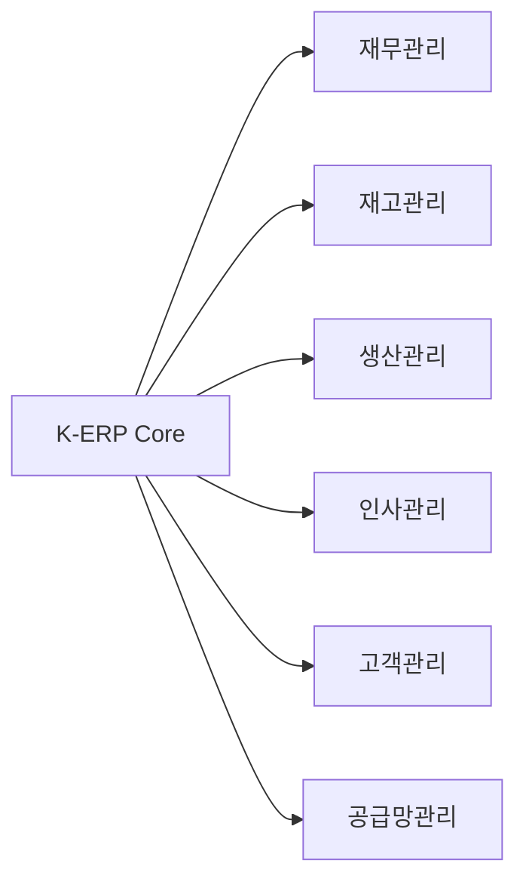

# 챕터 2: ERP / MES 시스템

기업 자원 관리(ERP)와 제조 실행 시스템(MES)은 제조업의 디지털 전환 핵심입니다. 이 챕터는 한국 중소기업을 대상으로 개발한 클라우드 ERP/MES 시스템들을 다룹니다.

---

## 2.1 K-ERP SaaS 플랫폼

**저장소**: `02_ERP/saas-erpmes` (GitHub: saintgo7/saas-erpmes-2601)
**타입**: Go · React · PostgreSQL · Docker

### 개요

한국형 클라우드 ERP 시스템 — 중소기업 대상 (연매출 10억~1000억원). 국내 중소 제조기업을 위한 클라우드 기반 통합 ERP 시스템입니다.

### 비즈니스 목표

- **타겟**: 연매출 10억~1000억원 중소기업
- **문제 해결**: 레거시 ERP 시스템 교체 및 클라우드 전환
- **경쟁력**: 한국 비즈니스 환경에 최적화된 기능

### 핵심 모듈



### 기술 스택

| 구성요소 | 기술 |
|----------|------|
| Backend | Go 1.22+ |
| Frontend | React 18.2+ |
| Database | PostgreSQL 16 |
| Cache | Redis |
| Infra | Docker Compose |

### 개발 로드맵

| Phase | 내용 |
|-------|------|
| Phase 1 | 기본 ERP (재무, 재고) |
| Phase 2 | 생산/MES 연동 |
| Phase 3 | AI 기반 예측 분석 |
| Phase 4 | 모바일 앱 |

---

## 2.2 Web-SmartFactory-ErpMes — 스마트 제조 통합 솔루션

**저장소**: `02_ERP/web-erpmes-v2` (GitHub: e2both/Web-SmartFactory-ErpMes)
**타입**: Laravel 11 · PHP · MySQL

### 개요

스마트 제조를 위한 통합 ERP/MES 솔루션입니다. Laravel 기반으로 구축되어 안정성과 확장성을 갖추고 있습니다.

### ERP vs MES 비교

| 항목 | ERP (기업 자원 관리) | MES (제조 실행 시스템) |
|------|---------------------|----------------------|
| 범위 | 전사 비즈니스 프로세스 | 제조 현장 실행 |
| 실시간성 | 배치/일별 | 실시간 |
| 사용자 | 관리자/경영진 | 현장 작업자 |
| 데이터 | 재무/인사/물류 | 생산/품질/설비 |

---

## 2.3 SaaS Trip ERP — 여행사 ERP

**저장소**: `02_ERP/saas-trip-erp` (GitHub: saintgo7/saas-trip-erp)
**타입**: Node.js · Docker

### 개요

여행사 특화 ERP 시스템입니다. 여행 상품 관리, 고객 예약, 가이드 관리, 정산까지 여행사 업무 전반을 디지털화합니다.

---

## 2.4 K-ERP Clone & 실험 프로젝트

**저장소**: `02_ERP/saas-kerp-clone` (GitHub: saintgo7/saas-kerp)
**타입**: Node.js · Go

### 개요

기존 KERP 시스템의 아키텍처를 분석하고 모던 기술 스택으로 재구현한 클론 프로젝트입니다. 학습 목적과 함께 실제 개선 방향을 모색합니다.

---

## 2.5 ERP 개발 인사이트

### 한국형 ERP의 특수성

한국 ERP 개발 시 반드시 고려해야 할 요소들:

::: important
**전자세금계산서 연동**

국세청 e-Tax 시스템 API 연동이 필수입니다. 발행, 수취, 수정, 취소 등 복잡한 플로우를 처리해야 합니다.
:::

::: note
**한국 근로기준법 준수**

주52시간 근무제, 연장근로 수당 계산, 4대보험 신고 등 한국 법률에 맞는 HR 모듈 구현이 필요합니다.
:::

### ERP 데이터 모델 기본 구조

```typescript
// 기본 엔티티 구조
interface Company {
  id: string;
  businessNumber: string;  // 사업자번호
  name: string;
  type: 'corporation' | 'individual';
}

interface FiscalYear {
  companyId: string;
  year: number;
  startDate: Date;
  endDate: Date;
  closed: boolean;
}

interface Account {
  code: string;           // 계정과목 코드
  name: string;           // 계정과목명
  type: AccountType;      // 자산/부채/자본/수익/비용
  parentCode?: string;    // 상위 계정
}
```

---

::: tip
ERP 프로젝트는 도메인 지식이 기술 역량만큼 중요합니다. 회계, 세무, 노무, 물류 전문가와의 협업을 통해 비즈니스 로직을 정확히 구현해야 합니다.
:::
