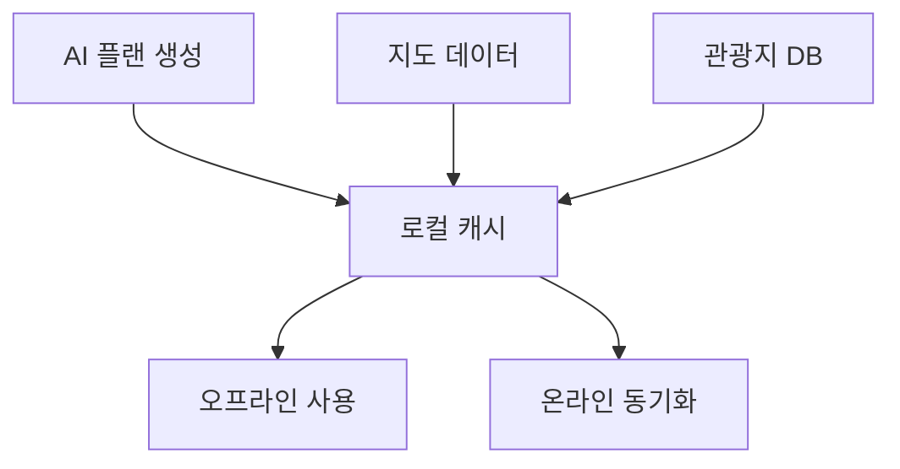

# 챕터 3: 여행 / 관광 플랫폼

한국 관광 산업의 디지털화를 목표로 개발한 여행 플랫폼들입니다. OCR 기반 여권 인식부터 AI 여행 계획 생성, 한국 문화 콘텐츠 플랫폼까지 다양한 접근을 시도했습니다.

---

## 3.1 TravelPass — 여행사 여권 OCR 시스템

**저장소**: `03_TRAVEL/app-passport-reserve` (GitHub: saintgo7/app-passport-reserve)
**타입**: Python · FastAPI · Docker

### 개요

여행사 실무에 최적화된 여권 자동인식 및 개인정보 관리 시스템입니다. 여권 스캔 → OCR 인식 → 자동 정보 입력까지 여행사의 반복 업무를 자동화합니다.

### 기술 스택

| 구성요소 | 기술 |
|----------|------|
| Backend | Python 3.11+ · FastAPI 0.109.0 |
| OCR | Tesseract · OpenCV |
| Database | PostgreSQL |
| Infra | Docker |

### 여권 OCR 처리 흐름


### MRZ (Machine Readable Zone) 파싱

여권 하단의 기계 판독 영역을 파싱하는 핵심 로직:

```python
def parse_mrz(mrz_line1: str, mrz_line2: str) -> dict:
    """
    ICAO 9303 표준에 따른 여권 MRZ 파싱
    Line 1: 문서유형, 발행국, 성명
    Line 2: 여권번호, 국적, 생년월일, 성별, 만료일
    """
    return {
        "passport_number": mrz_line2[0:9].strip("<"),
        "nationality": mrz_line2[10:13],
        "birth_date": parse_date(mrz_line2[13:19]),
        "sex": mrz_line2[20],
        "expiry_date": parse_date(mrz_line2[21:27]),
        "surname": mrz_line1[5:44].split("<<")[0].replace("<", " "),
        "given_name": mrz_line1[5:44].split("<<")[1].replace("<", " "),
    }
```

---

## 3.2 K-Guide — AI 한국 문화 콘텐츠 플랫폼

**저장소**: `03_TRAVEL/k-guide-platform` (GitHub: saintgo7/saas-k-guide)
**타입**: NestJS · Next.js · TypeScript · Docker

### 개요

AI 기반 한국 문화, 언어, 음식 콘텐츠 플랫폼입니다. 외국인이 한국 문화, 언어, 음식, 관광을 탐색할 수 있는 AI 도구와 종합 콘텐츠를 제공합니다.

### 핵심 기능

- **관광 정보**: 한국관광공사 API (100K+ POI) 연동
- **AI 콘텐츠**: OpenAI GPT-4o 기반 개인화 콘텐츠
- **언어 번역**: 한국어 학습 도구
- **음식 가이드**: 한식 소개 및 추천
- **구독**: Polar.sh 기반 유료 구독

### 기술 스택

| 레이어 | 기술 |
|--------|------|
| Backend | NestJS 10+ |
| Frontend | Next.js 14+ |
| Language | TypeScript 5.0+ |
| Package Manager | pnpm 10+ |
| Node | 22.0.0+ |

---

## 3.3 K-Guide ABADA Kr — 한국 문화 가이드

**저장소**: `03_TRAVEL/k-guide-abada-kr` (GitHub: saintgo7/k-guide-abada-kr)
**타입**: Node.js · Docker

K-Guide 플랫폼의 한국어 버전으로, 내국인 대상 한국 문화 및 여행 정보 서비스입니다.

---

## 3.4 K-Trip — AI 여행 계획 앱

**저장소**: `03_TRAVEL/mobile-ktrip` (GitHub: saintgo7/mobile-ktrip)
**타입**: Node.js · Docker · Mobile

### 개요

외국인 한국 방문자를 위한 AI 기반 여행 계획 앱입니다.

**핵심 미션**: AI가 100% 오프라인에서도 작동하는 개인화 여행 계획을 생성합니다.

### 오프라인 우선 아키텍처



---

## 3.5 SkyAir — 항공권 예약 웹

**저장소**: `03_TRAVEL/web-skyair` (GitHub: saintgo7/skyair-travel)
**타입**: Next.js

Next.js App Router 기반의 항공권 조회 및 예약 서비스입니다.

---

## 3.6 여행 플랫폼 개발 인사이트

### 한국 관광 API 생태계

한국 여행 플랫폼 개발 시 활용 가능한 주요 공공 API:

| API | 제공기관 | 데이터 |
|-----|----------|--------|
| 한국관광공사 API | 문화체육관광부 | 100K+ 관광지 POI |
| 기상청 날씨 API | 기상청 | 실시간 날씨 |
| 대중교통 API | 국토교통부 | 버스/지하철 정보 |
| 출입국관리 API | 법무부 | 비자 정보 |

::: tip
한국관광공사 TourAPI 4.0은 무료로 제공되며, 음식점, 숙박, 관광지, 문화시설, 레저/스포츠 등 5개 카테고리로 구분된 방대한 데이터를 제공합니다.
:::
