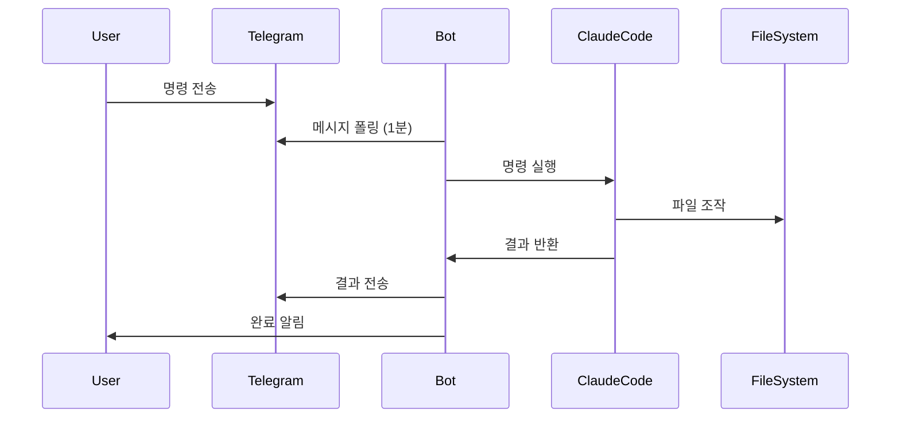

# 챕터 4: AI / Bot 개발

AI와 자동화 봇은 현대 개발의 핵심입니다. Claude API, OpenAI GPT, CrewAI 등을 활용한 다양한 AI 에이전트와 자동화 시스템을 구축한 경험을 담습니다.

---

## 4.1 소놀봇 — 텔레그램 × Claude Code 자율 봇

**저장소**: `04_AI_BOT/bot-claude-code`
**타입**: Python

### 개요

텔레그램을 통해 실시간으로 지시사항을 받고 Claude Code가 자동으로 작업을 처리하는 자율 작업 봇입니다.

### 주요 기능

| 기능 | 설명 |
|------|------|
| 텔레그램 통합 | 텔레그램으로 명령을 보내면 자동 처리 |
| Claude Code 자동 실행 | AI가 코드 작성, 파일 생성, 분석 등 자동 수행 |
| 메모리 시스템 | 모든 작업 기록 및 컨텍스트 유지 |
| 자동 스케줄링 | 1분마다 자동으로 새 메시지 확인 |
| 파일/이미지 지원 | 사진, 문서, 비디오, 위치 정보 자동 처리 |
| 효율적 실행 | 새 메시지 없으면 0.1초만에 종료 (98% 시간 절약) |

### 아키텍처



### 핵심 구현

```python
import anthropic
import subprocess
from telegram import Bot

class SonolBot:
    def __init__(self):
        self.bot = Bot(token=TELEGRAM_TOKEN)
        self.claude = anthropic.Anthropic()
        self.memory = MemorySystem()

    def process_command(self, command: str) -> str:
        # Claude Code를 subprocess로 실행
        result = subprocess.run(
            ["claude", "--print", command],
            capture_output=True,
            text=True,
            timeout=300
        )
        return result.stdout

    def run(self):
        updates = self.bot.get_updates()
        if not updates:
            return  # 0.1초에 종료 (98% 시간 절약)

        for update in updates:
            response = self.process_command(update.message.text)
            self.bot.send_message(
                chat_id=update.message.chat_id,
                text=response
            )
```

### 요구사항

- Windows 10/11 (작업 스케줄러 사용)
- Python 3.8+
- Claude Code (설치됨)
- 텔레그램 봇 토큰 (BotFather에서 발급)

---

## 4.2 CrewBot Core — CrewAI 기반 에이전트

**저장소**: `04_AI_BOT/crewbot-core` (GitHub: saintgo7/saas-crewbot)
**타입**: Python

### 개요

CrewAI 프레임워크를 활용한 멀티 에이전트 시스템입니다. 여러 AI 에이전트가 협력하여 복잡한 작업을 처리합니다.

### CrewAI 멀티 에이전트 패턴

```python
from crewai import Agent, Task, Crew

researcher = Agent(
    role="Research Analyst",
    goal="시장 조사 및 데이터 수집",
    backstory="10년 경력의 시장 분석가",
    verbose=True
)

writer = Agent(
    role="Content Writer",
    goal="연구 결과를 기반으로 보고서 작성",
    backstory="기술 문서 전문 작가"
)

research_task = Task(
    description="한국 SaaS 시장 동향 조사",
    agent=researcher
)

write_task = Task(
    description="조사 결과를 바탕으로 보고서 작성",
    agent=writer
)

crew = Crew(
    agents=[researcher, writer],
    tasks=[research_task, write_task]
)

result = crew.kickoff()
```

---

## 4.3 CrewBot SaaS — AI 봇 SaaS 플랫폼

**저장소**: `04_AI_BOT/crewbot-saas` (GitHub: saintgo7/crew-bot-gpt)
**타입**: Python · Docker

CrewBot의 SaaS 버전으로, 멀티테넌트 AI 에이전트 서비스를 제공합니다.

---

## 4.4 CrewBot GPT — GPT 기반 봇

**저장소**: `04_AI_BOT/crewbot-gpt`
**타입**: Python · Docker

OpenAI GPT-4를 백엔드로 활용한 챗봇 시스템입니다.

---

## 4.5 AI 개발 인사이트

### Claude API vs OpenAI GPT 비교

| 항목 | Claude API | OpenAI GPT |
|------|-----------|------------|
| 컨텍스트 윈도우 | 200K tokens | 128K tokens |
| 코드 품질 | 우수 | 우수 |
| 한국어 지원 | 양호 | 양호 |
| 가격 | 경쟁적 | 경쟁적 |
| 특징 | 안전성 강조 | 광범위한 에코시스템 |

### AI 에이전트 설계 원칙

::: important
**명확한 역할 정의 (Single Responsibility)**

각 에이전트는 하나의 명확한 역할을 가져야 합니다. 역할이 불분명하면 에이전트 간 충돌이 발생합니다.
:::

::: tip
**메모리 관리가 핵심**

장기 실행 봇에서는 컨텍스트 누적으로 API 비용이 급증할 수 있습니다. 슬라이딩 윈도우나 요약 기반 메모리 전략을 사용하세요.
:::

### 프롬프트 엔지니어링 베스트 프랙티스

```python
SYSTEM_PROMPT = """
당신은 [역할]입니다.

## 목표
- [구체적인 목표 1]
- [구체적인 목표 2]

## 제약사항
- [절대 하지 말아야 할 것]
- [형식 제약]

## 출력 형식
[출력 형식 명시]
"""
```

---

::: note
AI 봇 개발에서 가장 중요한 것은 "실패 처리"입니다. AI 응답이 예상치 못한 형식으로 오거나, API 타임아웃이 발생하거나, 컨텍스트가 초과될 때의 처리가 서비스 안정성을 결정합니다.
:::
