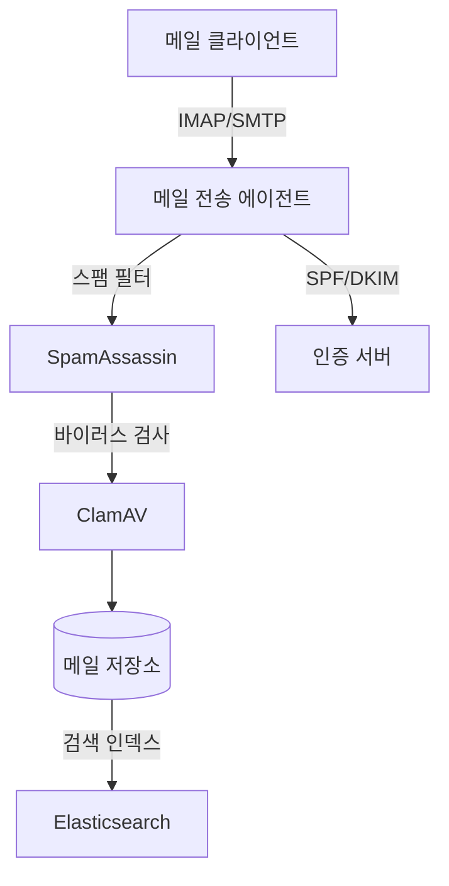

# 챕터 5: 이메일 / 커뮤니케이션

기업 내부 커뮤니케이션 인프라는 생산성의 핵심입니다. 여행사 특화 사내 메일 시스템 구축 프로젝트의 기획과 설계를 담습니다.

---

## 5.1 SaaS Email Sky — 여행사 사내 메일 시스템

**저장소**: `05_EMAIL/saas-email-sky`, `05_EMAIL/saas-mail-sky`
**GitHub**: saintgo7/saas-mail-sky

### 개요

여행사 사내 메일 시스템 구축 프로젝트입니다. 현재 Sprint 0 단계(요구사항/보안/운영 템플릿 정리)입니다.

### 주요 문서 구조

```
saas-email-sky/
├── ENTERPRISE_INTERNAL_EMAIL_MASTER_PLAN.md  # 마스터 개발 계획서
├── requirements/                              # 요구사항 문서
├── security/                                  # 보안 정책
└── operations/                               # 운영 템플릿
```

### 엔터프라이즈 이메일 시스템 요구사항

**기능 요구사항:**
- 받은 편지함, 보낸 편지함, 임시 보관함
- 폴더/라벨 관리
- 검색 기능 (전문 검색)
- 첨부 파일 관리
- 이메일 서명 관리
- 일정 연동 (iCal)
- 주소록 연동

**보안 요구사항:**
- TLS/SSL 암호화 (전송 중)
- AES-256 암호화 (저장 시)
- SPF, DKIM, DMARC 설정
- 2FA (이중 인증)
- 감사 로그

### 이메일 서버 아키텍처



### 이메일 프로토콜 비교

| 프로토콜 | 용도 | 포트 | 특징 |
|----------|------|------|------|
| SMTP | 메일 발송 | 25, 587, 465 | 발신 전용 |
| IMAP | 메일 수신/동기화 | 143, 993 | 서버에 메일 유지 |
| POP3 | 메일 수신 | 110, 995 | 메일 다운로드 후 삭제 |

::: tip
현대 기업 이메일 시스템에서는 IMAP이 표준입니다. 여러 기기에서 동기화되는 IMAP과 달리, POP3는 단일 기기 사용에만 적합합니다.
:::

### 스팸 방지 3요소

**SPF (Sender Policy Framework)**
```
# DNS TXT 레코드 예시
v=spf1 include:_spf.google.com ~all
```

**DKIM (DomainKeys Identified Mail)**
```
# 메일 헤더에 디지털 서명 추가
DKIM-Signature: v=1; a=rsa-sha256; d=example.com; s=mail;
  h=from:to:subject:date; bh=BASE64; b=SIGNATURE
```

**DMARC (Domain-based Message Authentication)**
```
# DNS TXT 레코드 예시
v=DMARC1; p=quarantine; rua=mailto:dmarc@example.com
```

---

## 5.2 이메일 개발 인사이트

### 자체 이메일 서버 vs SaaS 이메일

| 항목 | 자체 서버 | SaaS (Google Workspace) |
|------|-----------|------------------------|
| 초기 비용 | 높음 | 낮음 |
| 운영 비용 | 낮음 (장기) | 월정액 |
| 보안 관리 | 직접 | 위임 |
| 커스터마이징 | 높음 | 제한적 |
| 유지보수 | 직접 | 불필요 |
| 적합한 규모 | 100인+ 기업 | 소규모 팀 |

::: warning
이메일 서버를 직접 운영할 경우, IP 평판 관리가 가장 중요합니다. 새 IP에서 대량 메일을 발송하면 즉시 스팸으로 분류됩니다. 워밍업(warming-up) 기간이 반드시 필요합니다.
:::
