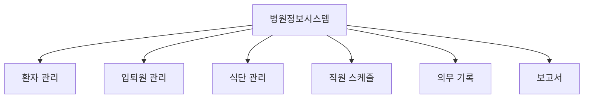

# 챕터 6: 헬스케어

의료와 건강 관련 소프트웨어는 정확성과 신뢰성이 최우선입니다. 요양병원 관리 시스템과 식단 관리 서비스 개발 경험을 담습니다.

---

## 6.1 App Hospital Yoyang — 요양병원 관리 시스템

**저장소**: `06_HEALTHCARE/app-hospital-yoyang` (GitHub: saintgo7/app-hospital-yoyang)
**타입**: Node.js · Docker · Supabase

### 개요

요양병원 운영 관리를 위한 통합 시스템입니다. 환자 관리, 입퇴원 관리, 식단 관리, 직원 스케줄링 등 요양병원의 핵심 업무를 디지털화합니다.

### 핵심 기능 영역



### 기술 스택

| 구성요소 | 기술 |
|----------|------|
| Backend | Node.js |
| Database | Supabase (PostgreSQL) |
| Infra | Docker |

### Supabase 활용

Supabase를 BaaS(Backend as a Service)로 활용하여 개발 속도를 높였습니다:

```typescript
import { createClient } from '@supabase/supabase-js'

const supabase = createClient(SUPABASE_URL, SUPABASE_ANON_KEY)

// 환자 조회
const { data: patients, error } = await supabase
  .from('patients')
  .select('*, admissions(*)')
  .eq('ward_id', wardId)
  .order('bed_number')

// 실시간 구독 (입퇴원 이벤트)
const channel = supabase
  .channel('admissions')
  .on('postgres_changes', {
    event: '*',
    schema: 'public',
    table: 'admissions'
  }, (payload) => {
    console.log('입퇴원 변경:', payload)
  })
  .subscribe()
```

### 데이터 모델 핵심

```sql
-- 환자 테이블
CREATE TABLE patients (
  id UUID PRIMARY KEY DEFAULT gen_random_uuid(),
  name VARCHAR(100) NOT NULL,
  birth_date DATE NOT NULL,
  gender CHAR(1) CHECK (gender IN ('M', 'F')),
  id_number VARCHAR(14) UNIQUE,  -- 주민등록번호 (암호화)
  phone VARCHAR(20),
  guardian_name VARCHAR(100),
  guardian_phone VARCHAR(20),
  created_at TIMESTAMPTZ DEFAULT NOW()
);

-- 입퇴원 테이블
CREATE TABLE admissions (
  id UUID PRIMARY KEY DEFAULT gen_random_uuid(),
  patient_id UUID REFERENCES patients(id),
  ward_id UUID REFERENCES wards(id),
  bed_number INTEGER,
  admitted_at TIMESTAMPTZ NOT NULL,
  discharged_at TIMESTAMPTZ,
  diagnosis TEXT,
  doctor_id UUID REFERENCES staff(id)
);
```

---

## 6.2 App Sungnam Food — 성남 식단 관리

**저장소**: `06_HEALTHCARE/app-sungnam-food`

### 개요

성남 지역 의료/복지 기관을 위한 식단 관리 애플리케이션입니다. 영양 균형을 고려한 식단 계획, 식재료 관리, 알레르기 정보 관리를 제공합니다.

---

## 6.3 헬스케어 개발 인사이트

### 의료 데이터 보안 필수 요소

::: important
**개인의료정보 보호 (PIPA/의료법)**

한국 의료법상 환자 개인정보는 특별히 보호됩니다. 주민등록번호는 반드시 암호화 저장해야 하며, 접근 로그를 모두 기록해야 합니다.
:::

### 요양병원 특수 요구사항

일반 병원과 달리 요양병원의 특수성:

| 항목 | 일반 병원 | 요양병원 |
|------|----------|---------|
| 입원 기간 | 단기 (일~주) | 장기 (월~년) |
| 주요 환자 | 급성기 환자 | 만성/재활 환자 |
| 식단 관리 | 기본 | 매우 중요 (영양 케어) |
| 가족 소통 | 간헐적 | 지속적 |
| 보험 청구 | 건강보험 | 건강보험 + 장기요양보험 |

::: note
장기요양보험 청구는 국민건강보험공단 시스템과 연동이 필요하며, 별도의 API 연동 과정이 있습니다.
:::
