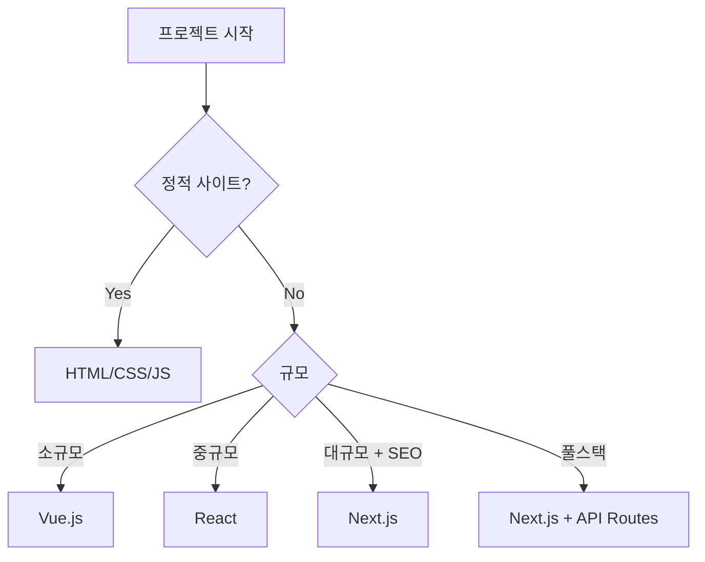

# 챕터 7: 웹 프로젝트

다양한 목적의 웹 애플리케이션들입니다. 음악 라이브러리, 디자인 도구, 개발 추적기, 제품 관리까지 폭넓은 웹 개발 경험을 담습니다.

---

## 7.1 Music Heartlib — 음악 라이브러리 플랫폼

**저장소**: `07_WEB/music-heartlib` (GitHub: saintgo7/web-music-heartlib)
**타입**: Node.js

### 개요

개인 음악 컬렉션을 관리하고 공유하는 웹 플랫폼입니다.

---

## 7.2 Design A2UI — UI 디자인 시스템

**저장소**: `07_WEB/design-a2ui`

### 개요

재사용 가능한 UI 컴포넌트 라이브러리 및 디자인 시스템입니다.

---

## 7.3 Dev Tracker — 개발 활동 추적기

**저장소**: `07_WEB/dev-tracker`
**타입**: Node.js

### 개요

개발자의 일일 활동(커밋, PR, 코드 리뷰 등)을 추적하고 시각화하는 도구입니다.

### 추적 지표

| 지표 | 설명 |
|------|------|
| 커밋 수 | 일별/주별/월별 커밋 통계 |
| 코드 변경량 | 추가/삭제 라인 수 |
| PR 활동 | 생성, 리뷰, 머지 횟수 |
| 이슈 처리 | 오픈/클로즈 이슈 수 |
| 개발 시간 | Git 커밋 시간 기반 추정 |

---

## 7.4 Product Jichim — 제품 관리

**저장소**: `07_WEB/product-jichim`
**타입**: Python

### 개요

제품(지침) 관리 시스템으로, 제품 목록, 재고, 카탈로그 관리를 제공합니다.

---

## 7.5 HTML Templates — 웹 템플릿 컬렉션

**저장소**: `07_WEB/html-templates`
**타입**: Node.js

### 개요

프로젝트 빠른 시작을 위한 HTML/CSS/JS 템플릿 모음입니다.

### 포함된 템플릿

| 템플릿 | 용도 |
|--------|------|
| Landing Page | 서비스 소개 페이지 |
| Dashboard | 관리자 대시보드 |
| Auth Pages | 로그인/회원가입 |
| Blog | 블로그 레이아웃 |
| Portfolio | 포트폴리오 |

---

## 7.6 Music ABADA

**저장소**: `07_WEB/music-abada`

ABADA 브랜드의 음악 서비스 프로토타입입니다.

---

## 7.7 웹 개발 인사이트

### 프론트엔드 기술 스택 선택 가이드

### CSS 아키텍처 방법론 비교

| 방법론 | 장점 | 단점 |
|--------|------|------|
| BEM | 명확한 네이밍 | 장황한 클래스명 |
| Tailwind CSS | 빠른 개발 | HTML 복잡도 증가 |
| CSS Modules | 스코프 격리 | 동적 스타일 어려움 |
| Styled Components | JS 통합 | 런타임 오버헤드 |

::: tip
프로토타입이나 MVP 개발 시에는 Tailwind CSS가 가장 빠릅니다. 디자이너와 협업하는 프로덕션 환경에서는 CSS Modules 또는 BEM이 유지보수에 유리합니다.
:::
