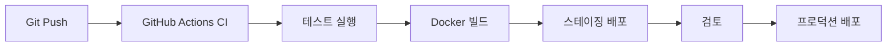

# 챕터 8: 개발 도구

개발 생산성을 높이는 도구들입니다. Claude Code 훅 로거, 개발 로그 플랫폼, CLI 도구, SaaS 템플릿까지 — 개발자를 위한 개발자 도구 모음입니다.

---

## 8.1 Claude Hook Logger — Claude Code 이벤트 로거

**저장소**: `08_DEVTOOLS/claude-hook-logger` (GitHub: devstefancho/claude-hook-logger)
**타입**: Node.js

### 개요

Claude Code 훅 이벤트를 실시간으로 로깅하고 웹 대시보드로 시각화하는 시스템입니다.

### 기능

- Claude Code 훅 이벤트 실시간 캡처
- 웹 대시보드로 활동 시각화
- 이벤트 히스토리 저장 및 검색
- 세션별 활동 통계

### Claude Code 훅 이벤트 종류

| 이벤트 | 트리거 시점 |
|--------|------------|
| `PreToolUse` | 도구 실행 전 |
| `PostToolUse` | 도구 실행 후 |
| `SessionStart` | 세션 시작 |
| `SessionEnd` | 세션 종료 |
| `UserPromptSubmit` | 사용자 메시지 전송 시 |

### 훅 설정 예시

```json
// ~/.claude/settings.json
{
  "hooks": {
    "PreToolUse": [
      {
        "matcher": "Bash",
        "hooks": [
          {
            "type": "command",
            "command": "node /path/to/claude-hook-logger/logger.js pre"
          }
        ]
      }
    ]
  }
}
```

---

## 8.2 DevLog Hub — 개발 로그 중앙 관리 플랫폼

**저장소**: `08_DEVTOOLS/full-dev-log` (GitHub: saintgo7/full-dev-log)
**타입**: Docker · CI/CD

### 개요

개발 활동을 자동으로 수집하고 중앙에서 관리하는 플랫폼입니다.

### CI/CD 파이프라인



---

## 8.3 SaaS Template — 프로젝트 문서 템플릿 시스템

**저장소**: `08_DEVTOOLS/saas-template` (GitHub: saintgo7/saas-vibe)

### 개요

소프트웨어 프로젝트 문서화 템플릿 시스템으로, 빠른 프로젝트 셋업을 위한 16개 설계 문서 템플릿을 제공합니다. SMERP(한국형 SaaS ERP) 프로젝트에서 검증된 템플릿 기반입니다.

### 16개 설계 문서 템플릿

| 번호 | 문서 | 설명 |
|------|------|------|
| 01 | PRD | 제품 요구사항 정의서 |
| 02 | TRD | 기술 요구사항 정의서 |
| 03 | User Flow | 사용자 흐름도 |
| 04 | ERD | 데이터베이스 설계 |
| 05 | API Design | API 설계 문서 |
| 06 | Architecture | 시스템 아키텍처 |
| 07 | Design System | 디자인 시스템 |
| 08 | Component | 컴포넌트 설계 |
| 09 | State Management | 상태 관리 설계 |
| 10 | Auth | 인증/인가 설계 |
| 11 | Test Plan | 테스트 계획 |
| 12 | Deploy | 배포 계획 |
| 13 | Monitor | 모니터링 계획 |
| 14 | Security | 보안 설계 |
| 15 | Performance | 성능 계획 |
| 16 | Maintenance | 유지보수 계획 |

---

## 8.4 pctools — 개발자 CLI 유틸리티

**저장소**: `08_DEVTOOLS/tui-tool`
**타입**: Node.js

### 개요

Unix-like 개발자 유틸리티 CLI입니다. Node.js, Commander, Ink, React를 활용한 모던 TUI(Terminal User Interface) 도구입니다.

```bash
# 설치 및 실행
npm install
npm start

# 주요 명령어
pctools status    # 시스템 상태 확인
pctools git       # Git 작업 도우미
pctools docker    # Docker 관리
pctools process   # 프로세스 모니터
```

---

## 8.5 Claude Code Notes — 학습 기록

**저장소**: `08_DEVTOOLS/claude-code-notes`

Claude Code 사용 중 발견한 팁, 트릭, 베스트 프랙티스를 정리한 노트 모음입니다.

---

## 8.6 개발 도구 개발 인사이트

### CLI 도구 설계 원칙

::: tip
**Good CLI Design (Unix Philosophy)**

1. 하나의 일만 잘 하라 (Do one thing well)
2. 텍스트 스트림으로 소통하라 (Plain text I/O)
3. 조합 가능하게 만들어라 (Composable)
4. 실패 시 명확한 메시지를 제공하라
:::

### Claude Code 훅 활용 패턴

```python
# PostToolUse 훅으로 Git 자동 스테이징
import json
import subprocess
import sys

hook_data = json.loads(sys.stdin.read())

if hook_data.get("tool_name") == "Write":
    file_path = hook_data.get("tool_input", {}).get("file_path", "")
    if file_path:
        subprocess.run(["git", "add", file_path])
        print(f"Auto-staged: {file_path}", file=sys.stderr)
```

### 개발자 도구 생산성 측정

| 도구 | 절약 시간/일 | 효과 |
|------|------------|------|
| 훅 로거 | 15분 | 디버깅 시간 단축 |
| DevLog 자동화 | 30분 | 문서화 자동화 |
| CLI 도구 | 20분 | 반복 명령어 제거 |
| 템플릿 시스템 | 2시간/프로젝트 | 초기 셋업 가속 |
