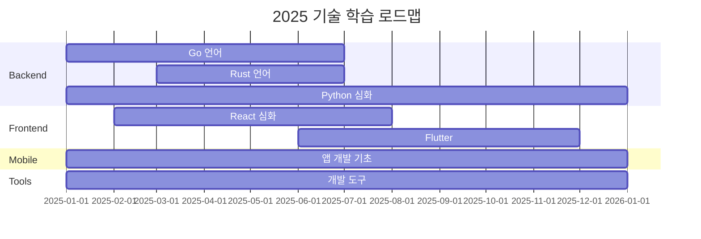

# 챕터 9: 학습 & 실험

지속적인 학습과 실험은 개발자 성장의 핵심입니다. 2025-2026년에 진행한 다양한 언어와 프레임워크 학습 프로젝트들을 담습니다.

---

## 9.1 학습 프로젝트 전체 개요

### 2025년 학습 로드맵



### 학습 프로젝트 목록

| 폴더 | 학습 주제 | 상태 |
|------|----------|------|
| `25-go` | Go 언어 기초 ~ 심화 | 진행 중 |
| `25-rust` | Rust 시스템 프로그래밍 | 진행 중 |
| `25-python` | Python 고급 패턴 | 완료 |
| `25-frontend` | React/Next.js 심화 | 진행 중 |
| `25-backend` | 백엔드 아키텍처 패턴 | 진행 중 |
| `25-dotnet` | .NET/C# 기초 | 실험적 |
| `25-cpp` | C++ 기초 | 실험적 |
| `25-app-mobile` | 모바일 앱 개발 | 진행 중 |
| `25-app-web` | 웹 앱 개발 | 진행 중 |
| `25-app-studio` | Android Studio | 실험적 |
| `25-tools` | 개발 도구 학습 | 진행 중 |
| `25-learning` | 종합 학습 노트 | 지속 |
| `26-plutter` | Flutter 2026 | 시작 |
| `26-ruby-rails` | Ruby on Rails | 시작 |

---

## 9.2 Go 언어 학습

**저장소**: `09_LEARNING/25-go`

### Go의 핵심 철학

Go 언어는 단순함, 효율성, 가독성을 최우선으로 합니다.

```go
// Go의 특징: 명시적 에러 처리
func readFile(path string) ([]byte, error) {
    data, err := os.ReadFile(path)
    if err != nil {
        return nil, fmt.Errorf("파일 읽기 실패: %w", err)
    }
    return data, nil
}

// Goroutine을 활용한 동시성
func main() {
    var wg sync.WaitGroup
    for i := 0; i < 10; i++ {
        wg.Add(1)
        go func(id int) {
            defer wg.Done()
            fmt.Printf("Worker %d 실행 중\n", id)
        }(i)
    }
    wg.Wait()
}
```

### Go 학습 커리큘럼

1. **기초**: 변수, 함수, 구조체, 인터페이스
2. **동시성**: Goroutine, Channel, sync 패키지
3. **HTTP**: net/http, Gin 프레임워크
4. **데이터베이스**: database/sql, GORM
5. **테스트**: testing 패키지, testify
6. **배포**: Docker, Kubernetes

---

## 9.3 Rust 언어 학습

**저장소**: `09_LEARNING/25-rust`

### Rust의 소유권 시스템

```rust
// Rust 핵심: 소유권과 빌림
fn main() {
    let s1 = String::from("hello");  // s1이 소유권 가짐

    let len = calculate_length(&s1);  // 빌림(borrow) - 소유권 이전 없음
    println!("'{}' 길이: {}", s1, len);  // s1 여전히 사용 가능
}

fn calculate_length(s: &String) -> usize {  // 참조 파라미터
    s.len()
}  // s는 참조이므로 drop 없이 반환

// Result 타입으로 안전한 에러 처리
fn divide(a: f64, b: f64) -> Result<f64, String> {
    if b == 0.0 {
        Err("0으로 나눌 수 없습니다".to_string())
    } else {
        Ok(a / b)
    }
}
```

---

## 9.4 Flutter 학습 (2026)

**저장소**: `09_LEARNING/26-plutter`

### Flutter vs React Native

| 항목 | Flutter | React Native |
|------|---------|--------------|
| 언어 | Dart | JavaScript/TypeScript |
| 렌더링 | 자체 렌더러 (Skia/Impeller) | 네이티브 컴포넌트 |
| 성능 | 매우 좋음 | 좋음 |
| 생태계 | 성장 중 | 성숙 |
| 학습 곡선 | 중간 | 낮음 (JS 개발자) |

```dart
// Flutter 기본 위젯
class MyApp extends StatelessWidget {
  @override
  Widget build(BuildContext context) {
    return MaterialApp(
      title: 'My App',
      theme: ThemeData(
        colorScheme: ColorScheme.fromSeed(seedColor: Colors.deepPurple),
      ),
      home: Scaffold(
        appBar: AppBar(title: Text('Hello Flutter')),
        body: Center(
          child: Text('Hello, World!'),
        ),
      ),
    );
  }
}
```

---

## 9.5 Ruby on Rails 학습 (2026)

**저장소**: `09_LEARNING/26-ruby-rails`

### Rails의 매력

Rails는 "Convention over Configuration" 원칙으로 빠른 MVP 개발에 최적화되어 있습니다.

```ruby
# 5분 만에 CRUD API 생성
rails generate scaffold Post title:string body:text published:boolean
rails db:migrate

# routes.rb에 자동 생성
resources :posts

# PostsController에 자동 생성된 7개 액션
# index, show, new, create, edit, update, destroy
```

---

## 9.6 실험 프로젝트: SaaS 테스트

| 폴더 | 실험 내용 |
|------|----------|
| `11_TEST/app-saas-claude` | Claude API 기반 SaaS 프로토타입 |
| `11_TEST/app-saas-codex` | OpenAI Codex 활용 실험 |
| `11_TEST/app-saas-gemini` | Google Gemini API 실험 |

---

## 9.7 학습 인사이트

### 언어별 학습 난이도 (주관적 평가)

| 언어 | 학습 난이도 | 생산성 | 사용 분야 |
|------|-----------|--------|----------|
| Python | ★☆☆☆☆ | ★★★★★ | AI/ML, 스크립트 |
| JavaScript | ★★☆☆☆ | ★★★★☆ | 웹 풀스택 |
| Go | ★★★☆☆ | ★★★★☆ | 백엔드, 시스템 |
| Rust | ★★★★★ | ★★★☆☆ | 시스템, 임베디드 |
| Flutter/Dart | ★★★☆☆ | ★★★★☆ | 모바일 크로스플랫폼 |

::: tip
새 언어를 배울 때 가장 효과적인 방법은 실제 프로젝트를 만드는 것입니다. 튜토리얼만 따라가면 실전에서 막힙니다. 작은 프로젝트라도 처음부터 끝까지 완성해보세요.
:::
