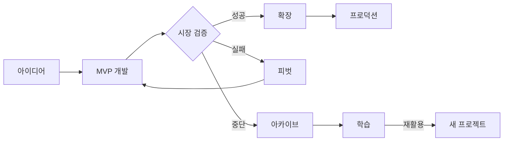

# 챕터 10: 기타 & 아카이브

메인 카테고리에 속하지 않는 다양한 프로젝트들과 아카이브를 담습니다.

---

## 10.1 기타 프로젝트 (10_MISC)

### App SDG — 지속가능발전목표 관련

**저장소**: `10_MISC/app-sdg`

유엔 지속가능발전목표(SDG) 관련 데이터 시각화 또는 추적 애플리케이션입니다.

---

### 개발 문서 통합 (docs)

**저장소**: `10_MISC/docs`

여러 프로젝트의 통합 문서화 저장소입니다.

---

### Portfolio Generator — 포트폴리오 자동 생성

**저장소**: `10_MISC/portfolio-gen`
**타입**: JetBrains (Kotlin/Java)

GitHub 프로필, 프로젝트 목록, 기술 스택을 자동으로 포트폴리오 페이지로 변환하는 도구입니다.

---

### OpenCode 관련

**저장소**: `10_MISC/opencode`

OpenCode(AI 기반 코딩 도구) 실험 및 설정 파일들입니다.

---

### Web Passport — 웹 여권

**저장소**: `10_MISC/web-passport`

웹 기반 여권 신청/관리 서비스 프로토타입입니다.

---

### Development Misc

**저장소**: `10_MISC/development-misc`

분류하기 어려운 소규모 개발 실험들의 모음입니다.

---

## 10.2 아카이브 (99_ARCHIVE)

### 24-Archive — 2024년 프로젝트 아카이브

**저장소**: `99_ARCHIVE/24-archive`

2024년에 시작하거나 완료한 프로젝트들의 아카이브입니다.

---

## 10.3 아카이브의 가치

### "완성하지 못한 프로젝트"에 대하여

::: note
개발자라면 누구나 완성하지 못한 프로젝트를 가지고 있습니다. 이것은 실패가 아닙니다.
:::

아카이브된 프로젝트에서 배울 수 있는 것들:

| 아카이브 이유 | 교훈 |
|-------------|------|
| 시장 검증 실패 | 빠른 MVP 검증의 중요성 |
| 기술 과부족 | 적절한 기술 스택 선택 |
| 방향 전환 | 피벗 결정의 타이밍 |
| 우선순위 변경 | 집중의 중요성 |

### 프로젝트 수명 주기

### 코드 재활용 전략

아카이브에서 재활용할 수 있는 것들:

1. **비즈니스 로직**: 도메인 지식은 언어와 무관하게 재사용 가능
2. **API 설계**: 검증된 API 구조
3. **데이터 모델**: ERD와 스키마 설계
4. **UI 컴포넌트**: 시각적 요소들
5. **알고리즘**: 핵심 알고리즘 구현

::: tip
아카이브를 주기적으로 검토하세요. 당시에는 시기상조였던 아이디어가 지금은 완벽한 타이밍일 수 있습니다.
:::
